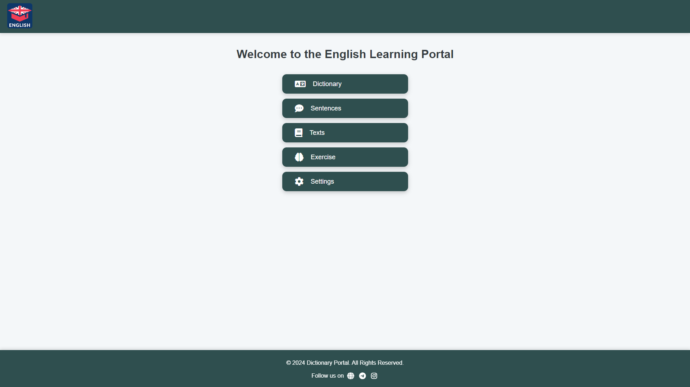
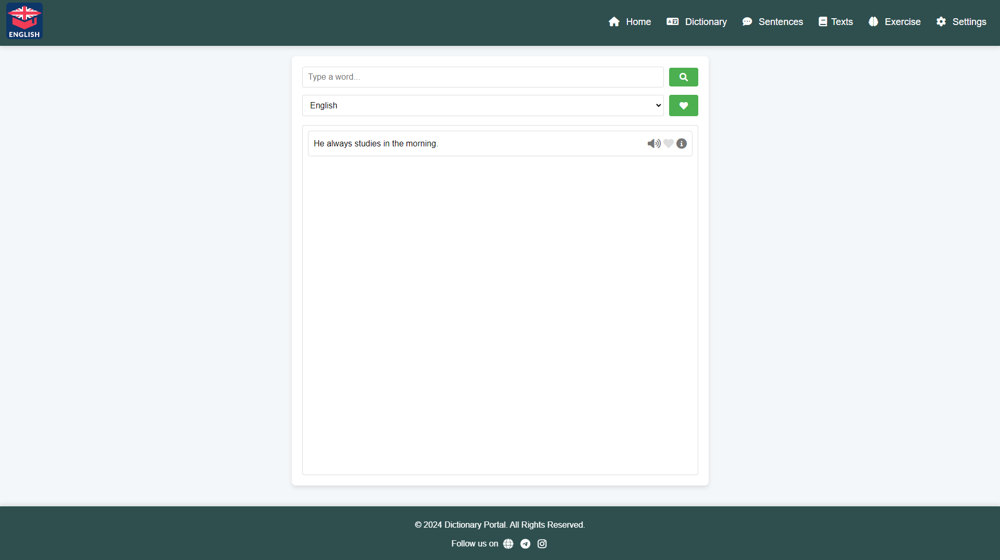
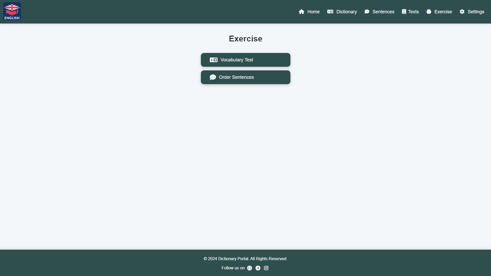
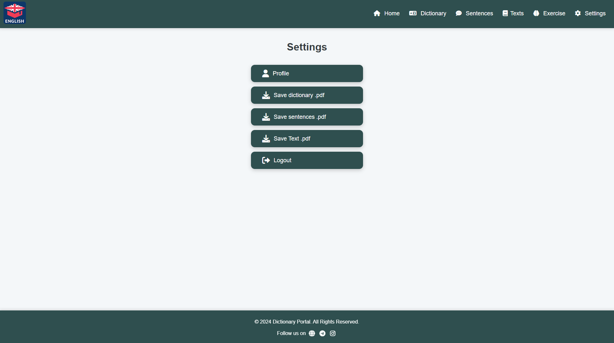

# English Learning Platform

This is an English learning platform designed to help users improve their vocabulary, sentence structure, and reading skills. The platform allows users to register, add their own vocabulary, sentences, and texts, and also provides exercises to enhance learning.

## Features

- **User Registration & Login**: Users can sign up, log in, and manage their profiles.
- **Vocabulary**: Users can add new words along with their translations and definitions.
- **Sentences**: Users can create sentences using the words they added and add translations.
- **Texts**: Users can upload and translate texts for reading practice.
- **Exercises**: 
  - **Vocabulary Test**: Tests where words are scrambled, and users must choose the correct answer from four options.
  - **Sentence Test**: Users reorder scrambled sentences to form a grammatically correct sentence.
- **Download PDFs**: Users can download their vocabulary, sentences, and texts in PDF format.
- **Search**: A search function to find words, sentences, and texts easily.
- **Favorite Words, Sentences, and Texts**: Users can save their favorite words, sentences, and texts.

## Pages

### Home Page

- **🖥 User Login:** `iqbolshoh`  
- **👤 User Login:** `user`  
- The home page welcomes users to the platform and provides navigation links to other sections.

### Dictionary Page

- Users can add and view vocabulary words along with their translations and definitions.

### Sentences Page

- Users can create and view sentences using the vocabulary words, including translations.

### Texts Page

- Users can upload and read texts, and add translations for practice.

### Exercises Page

- Contains tests for vocabulary and sentences to help users practice and improve their English.

### Settings Page

- Users can manage their account settings and preferences.

## Installation

1. Clone the repository:

```bash
git clone https://github.com/Iqbolshoh/website-english-platform.git
```

2. Navigate to the project directory:

```bash
cd website-english-platform
```

3. Install the necessary dependencies (if applicable):

```bash
npm install
```

4. Set up the database:

- Create a database called `english`.
- Import the provided `database.sql` file:

```sql
CREATE DATABASE english;

USE english;

CREATE TABLE users (
    id INT AUTO_INCREMENT PRIMARY KEY,
    fullname VARCHAR(255) NULL,
    email VARCHAR(255) NOT NULL UNIQUE,
    username VARCHAR(150) NOT NULL UNIQUE,
    password VARCHAR(255) NOT NULL,
    profile_image VARCHAR(255) DEFAULT 'default.png',
    created_at TIMESTAMP DEFAULT CURRENT_TIMESTAMP
);

-- (Add the rest of your database creation queries here)
```

5. Configure `config.php` with your database credentials:

```php
public function __construct()
    {
        $servername = "localhost";
        $username = "milliyto_shop";
        $password = "X?t&e#iF3Fc*";
        $dbname = "milliyto_english";

        $this->conn = new mysqli($servername, $username, $password, $dbname);

        if ($this->conn->connect_error) {
            die("Connection failed: " . $this->conn->connect_error);
        }
    }
```

6. Start the server:

- If you're using XAMPP or MAMP, place the project folder in the `htdocs` folder.
- Access the platform in your browser by navigating to `http://localhost/website-english-platform`.

## Usage

1. **Register and Login** to start using the platform.
2. Add words, sentences, and texts.
3. Participate in exercises to improve your English.
4. Download your learning materials as PDFs.

---

## 🖥 Technologies Used
<div style="display: flex; flex-wrap: wrap; gap: 5px;">
    
    
    
    
    
    
    
</div>

---

## 🤝 Contributing  

🎯 Contributions are welcome! If you have suggestions or want to enhance the project, feel free to fork the repository and submit a pull request.

## 📬 Connect with Me  

💬 I love meeting new people and discussing tech, business, and creative ideas. Let’s connect! You can reach me on these platforms:

<div align="center">
    <table>
        <tr>
            <td>
                <a href="https://github.com/iqbolshoh">
                    
                </a>
            </td>
            <td>
                <a href="https://t.me/iqbolshoh_777">
                    
                </a>
            </td>
            <td>
                <a href="https://www.linkedin.com/in/iiqbolshoh/">
                    
                </a>
            </td>
            <td>
                <a href="https://instagram.com/iqbolshoh_777" target="blank">
                    
                </a>
            </td>
            <td>
                <a href="https://wa.me/qr/22PVFQSMQQX4F1">
                    
                </a>
            </td>
            <td>
                <a href="https://x.com/iqbolshoh_777">
                    
                </a>
            </td>
            <td>
                <a href="mailto:iilhomjonov777@gmail.com">
                    
                </a>
            </td>
        </tr>
    </table>
</div>
